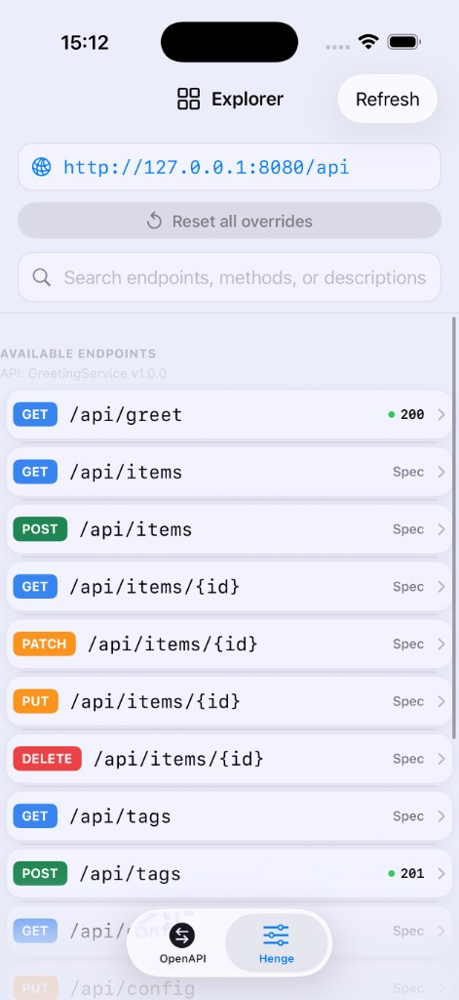
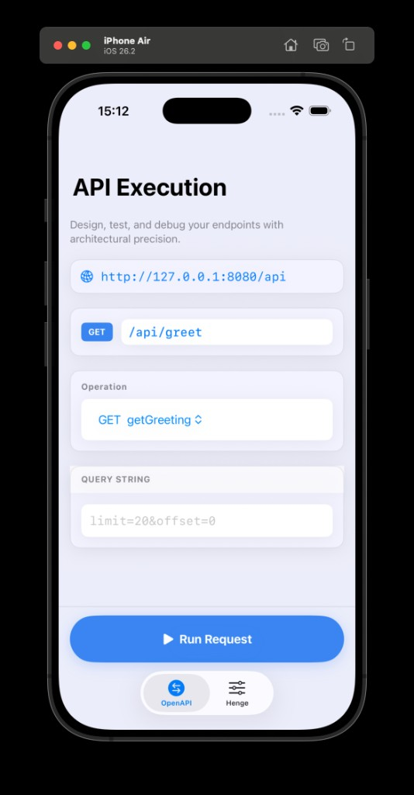

# サンプル（Examples）

**DemoPackage**（SwiftPM: OpenAPI 生成の `DemoAPI`、Vapor **DemoServer**）と **DemoApp**（Xcode 上の SwiftUI）です。本書は **このリポジトリのサンプル構成**・起動手順・**DemoApp** のスクリーンショットをまとめます。

- **ドキュメント一覧:** [docs/ja/README.md](../docs/ja/README.md) · [導入](../docs/ja/integration.md) · [Henge](../docs/ja/henge.md)
- **English:** [README.md](README.md)

## 構成

| パス | 役割 |
| --- | --- |
| [`DemoPackage/`](DemoPackage/) | Swift パッケージ: `DemoAPI`（Types + Client + Kawarimi プラグイン出力）、**`DemoAPITests`**、**`DemoServer`**（macOS・Vapor）。 |
| [`DemoApp/`](DemoApp/) | SwiftUI のソース。[`DemoApp.xcodeproj`](DemoApp.xcodeproj) を Xcode で開く。 |
| [`assets/`](assets/) | **DemoApp** の PNG（iOS シミュレータ）。下に本文へ埋め込み。 |

### DemoPackage の参照ソース

依存の全体像: [`DemoPackage/Package.swift`](DemoPackage/Package.swift)（`DemoServer` ターゲット）。サーバー起動まわり: [`main.swift`](DemoPackage/Sources/DemoServer/main.swift)、[`KawarimiRoutes.swift`](DemoPackage/Sources/DemoServer/KawarimiRoutes.swift)、[`KawarimiInterceptorMiddleware.swift`](DemoPackage/Sources/DemoServer/KawarimiInterceptorMiddleware.swift)。**`KawarimiInterceptorMiddleware` は KawarimiCore の製品ではありません**—自前の Vapor アプリではコピー／改変して使ってください。

## セキュリティ（サンプル限定）

**`__kawarimi`** 管理 API に**認証はありません**。

**`DemoApp`** の OpenAPI 実行は **Spec で定義されたベース URL** に向けます。信頼できる環境でのみ使い、実運用では認証・ネットワーク制御を自前で追加してください。

本サンプルは**本番向けの安全対策を含みません**。

## ビルドと DemoServer の起動

**カレントディレクトリを `DemoPackage/` に**して起動し、`kawarimi.json` の読み書き先をパッケージ隣に揃えます。

```bash
cd DemoPackage && swift build
swift run DemoServer   # kawarimi.json は DemoPackage/ 配下
KAWARIMI_CONFIG=/tmp/kawarimi.json swift run DemoServer
```

**`DemoServer`** は `KawarimiSpec.meta.apiPathPrefix`（OpenAPI `servers[0].url` のパス由来）を `pathPrefix` に渡すため、Henge のマウントが Spec と一致し、別の環境変数は不要です。

**`DemoAPITests`** がプロセス内の **`Kawarimi()`** トランスポートを検証します。

## kawarimi.json（サンプル）

`KawarimiConfigStore` は既定でカレントの `kawarimi.json` を読み書きします。空の初期ファイル例:

```json
{
  "overrides": []
}
```

本リポジトリの `DemoPackage` には `openapi.yaml` 隣に `kawarimi-generator-config.yaml` があります:

```yaml
handlerStubPolicy: throw
```

オーバーライドのマージ・タイブレークや空 body の扱いは [henge.md](../docs/ja/henge.md#kawarimijson--kawarimi_config) を参照してください。

<a id="henge-api-demoserver"></a>

## Henge API を試す（DemoServer）

既定の **`pathPrefix` `/api`** の例:

```bash
curl -X POST http://localhost:8080/api/__kawarimi/configure \
  -H "Content-Type: application/json" \
  -d '{"path":"/api/greet","method":"GET","statusCode":200,"isEnabled":true}'
```

Vapor での登録パターンは [henge.md](../docs/ja/henge.md) と [`KawarimiRoutes.swift`](DemoPackage/Sources/DemoServer/KawarimiRoutes.swift) を参照してください。

## クライアント: モックと DemoServer

開発中は **`Kawarimi()`**（ネットワークなし）と [swift-openapi-urlsession](https://github.com/apple/swift-openapi-urlsession) の **`URLSessionTransport()`** で **`DemoServer`** に繋ぐ、の両方を使えます。

**`DemoApp`** の Henge タブは **KawarimiHenge**、OpenAPI タブは起動中サーバーへの HTTP 用です。

## DemoApp の起動（SwiftUI・macOS / iOS）

1. 上記の **DemoServer** を起動する。
2. Xcode で **`DemoApp.xcodeproj`** を開き、**DemoApp** スキームを実行する。

**`DemoApp`** は **`DemoPackage` の `DemoAPI`** とリポジトリルートの **KawarimiCore / KawarimiHenge** にリンクしており、**`DemoPackage` に SwiftUI 依存はありません**。

**Server URL** と **API prefix** は `KawarimiSpec.meta` に固定（アプリ内は `KawarimiExampleConfig`）。

サンプルの `openapi.yaml` は **HTTP** かつ **`127.0.0.1`**（例: `http://127.0.0.1:8080/api`）。`localhost` が **`::1`** になり、Vapor が **IPv4 の 127.0.0.1** だけで待ち受けているときの接続拒否を避けるため。

**`DemoApp-Info.plist`**（同期対象の `DemoApp/` ではなく `DemoApp.xcodeproj` と同階層）で **NSAppTransportSecurity → NSAllowsLocalNetworking** を有効にし、ATS がローカル向け平文 HTTP を許可します。

**`DemoApp.entitlements`** で **App Sandbox** と **`com.apple.security.network.client`** を有効にし、URLSession がローカルサーバーへ接続できるようにしています（無いと `connectx` が *Operation not permitted* になります）。

デバイス／シミュレータからは、`openapi.yaml` の `servers` と実際の **DemoServer** のホストが一致するようにしてください。

## スクリーンショット（DemoApp・iOS シミュレータ）

### Henge — API Explorer タブ

メソッドバッジ付きのエンドポイント一覧、ベース URL、検索、**AVAILABLE ENDPOINTS** セクション。



### OpenAPI — API Execution タブ

ベース URL、Operation 選択、クエリ／ボディ入力、下部固定の **Run Request**、インラインのレスポンス表示。



## プラットフォーム

**`DemoPackage`** は **macOS 14+** 向けです。ルートのライブラリは **DemoApp** 用に **iOS 17+** も宣言しています（`Package.swift` の `platforms`）。
