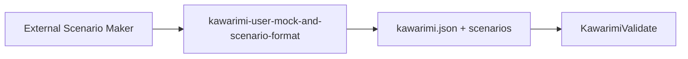

# Integration

How to add Kawarimi to a Swift package alongside [swift-openapi-generator](https://github.com/apple/swift-openapi-generator).

## Patterns

### Simple

- One library target (e.g. `MyAPI`) with a single **`openapi.yaml` / `openapi.yml` / `openapi.json`**, **OpenAPIGenerator**, and **KawarimiPlugin**. Build emits Types, Client, Server, and Kawarimi artifacts in that module.
- Client apps depend on `MyAPI` only; servers (e.g. Vapor) add Vapor and, for Henge, **KawarimiCore** and route wiring ([Example README](../Example/README.md)).
- **Pros:** smallest `Package.swift`, single config location. **Cons:** generated Server sources stay in the same module the app imports until you split targets.

### Recommended

- Keep **one OpenAPI document per target** (`openapi.yaml`, `openapi.yml`, or `openapi.json`) as the single source of truth, then use **separate generator setups** (targets and/or per-target `openapi-generator-config.yaml`) so the **client** builds **Types + Client** (and Kawarimi where needed) **without** shipping **Server** into the app, while the **server** builds **Types + Server**. Follow [swift-openapi-generator configuration](https://github.com/apple/swift-openapi-generator#configuration) so you do **not** duplicate Types in two modules.
- Attach **KawarimiPlugin** to the target that owns that document.
- **Pros:** clearer boundaries. **Cons:** more moving parts; **CI should build both** client and server targets.

## 1. Dependencies and plugins

Upgrading? See **[CHANGELOG.md](../CHANGELOG.md)**.

**2.7.0 → 3.0.0** (breaking — admin mutations):

1. Bump pin to **`from: "3.0.0"`**.
2. **Custom admin servers**:
   - **`POST …/__kawarimi/reload`**: **`200`** + JSON override array + **`X-Kawarimi-Reload`**, not **`204`**. Encode **`store.overrides()`** after **`reloadFromDisk()`**.
   - **`POST …/__kawarimi/configure`** / **`remove`** / **`reset`**: **`200`** + JSON override array (same as **`GET …/status`**), not empty **`200`**. Encode **`store.overrides()`** after the mutation.
3. **`KawarimiAPIClient`**: **`reload()`** returns **`KawarimiConfigReloadResponse`**; **`configure`** / **`removeOverride`** / **`reset`** return **`[MockOverride]`** instead of **`Void`** ([#147](https://github.com/novr/Kawarimi/issues/147)).

**2.6.0 → 2.7.0** (additive):

1. Bump pin to **`from: "2.7.0"`**.
2. **Server**: optional **`await store.startFileWatchIfEnabled()`** after **`KawarimiConfigStore`** init; disable with **`KAWARIMI_CONFIG_WATCH=0`**.
3. **Server**: optional **`KawarimiAdminRoute`** / **`KawarimiAdminSpecWire.validate`** for admin wiring — see [henge.md](henge.md) and [Example/README.md](../Example/README.md).
4. See **[CHANGELOG.md](../CHANGELOG.md)** under **2.7.0**.

**2.5.0 → 2.6.0** (breaking — Henge SSoT + Del):

1. Bump pin to **`from: "2.6.0"`**.
2. **Henge**: use **`KawarimiConfigView(client:)`** only — **`KawarimiConfigView(client:specType:)`** is removed. Pass **`KawarimiAPIClient(baseURL:)`** aligned with your admin mount; spec loads via **`GET …/__kawarimi/spec`** (**`HengeSpecSnapshot`**). Drop generated **`SpecResponse`** from Henge-only targets if no longer needed ([#120](https://github.com/novr/Kawarimi/issues/120)).
3. **Del**: saved row → **`remove`** in one step. To disable a mock but keep JSON in **`kawarimi.json`**, use **inactive chip + Save**, not **Del**.
4. See **[CHANGELOG.md](../CHANGELOG.md)** under **2.6.0**.

**2.4.0 → 2.5.0** (additive):

1. Bump pin to **`from: "2.5.0"`**.
2. Regenerate **`KawarimiSpec.swift`** when using **`SpecEndpointProviding`** or **`SpecResponse`** — endpoints may expose optional **`parameters`** (path, query, header) ([#74](https://github.com/novr/Kawarimi/issues/74), [#123](https://github.com/novr/Kawarimi/pull/123)).
3. **Henge** shows read-only **PARAMETERS** in the endpoint detail column.
4. Client-only or in-process **`Kawarimi()`** users need no change unless they use the spec endpoint or generated **`KawarimiSpec`** shape. See **[CHANGELOG.md](../CHANGELOG.md)** under **2.5.0**.

**2.0.5 → 2.1.0** (additive):

1. Bump pin to **`from: "2.1.0"`**.
2. Server: **KawarimiServer** + **`KawarimiServerMiddleware`** in **`registerHandlers(middlewares:)`** — [henge.md](henge.md), [Example/README.md](../Example/README.md).
3. Drop the old Vapor-global interceptor pattern for operation mocks if copied from Example.
4. Rebuild after OpenAPI regen so **`responseMap`** matches **`KawarimiSpec`**.

**2.1.0 → 2.2.0** (additive):

1. Bump pin to **`from: "2.2.0"`**.
2. Optional **`delayMs`** on overrides; optional **`POST …/__kawarimi/reload`** / **`KawarimiConfigStore.reloadFromDisk()`**.
3. Custom Henge UI: **`primaryEnabledOverrideForOperation`** / **`matchingEnabledOverridesForOperation`** ([#78](https://github.com/novr/Kawarimi/issues/78)).

**2.2.2 → 2.3.0** (additive):

1. Bump pin to **`from: "2.3.0"`**.
2. Regenerate **`KawarimiSpec.swift`** when using **`SpecEndpointProviding`** or **`SpecResponse`** — endpoints expose optional **`security`**; **`GET …/__kawarimi/spec`** includes **`securitySchemes`** when defined ([#102](https://github.com/novr/Kawarimi/pull/102)).
3. **Henge** displays **`securitySchemes`** and per-endpoint effective **`security`** read-only in the detail column ([#108](https://github.com/novr/Kawarimi/issues/108)); oauth2 flow URLs are not expanded yet.
4. Client-only or in-process **`Kawarimi()`** users need no change unless they use the spec endpoint or generated **`KawarimiSpec`** shape. See **[CHANGELOG.md](../CHANGELOG.md)** under **2.3.0**.

SwiftPM products:

- **Kawarimi** — OpenAPI codegen CLI (Build Tool Plugin invokes this).
- **KawarimiValidate** — validate `kawarimi.json` + `kawarimi-scenarios.json` structural consistency.
- **KawarimiCore** — runtime (`MockOverride`, `KawarimiConfigStore`, `KawarimiAPIClient`, …).
- **KawarimiJutsu** — generator API (CLI/tests; OpenAPIKit).
- **KawarimiHenge** — SwiftUI admin — [henge.md](henge.md).
- **KawarimiServer** — server dynamic mocks — [henge.md](henge.md).
- **KawarimiClient** — client scenario orchestration middleware — [henge.md](henge.md).

Targets with **KawarimiSpec.swift** need **`KawarimiCore`** and **`HTTPTypes`** as **direct** dependencies.

```swift
dependencies: [
    .package(url: "https://github.com/apple/swift-openapi-runtime", from: "1.0.0"),
    .package(url: "https://github.com/apple/swift-openapi-generator", from: "1.0.0"),
    .package(url: "https://github.com/apple/swift-http-types.git", from: "1.0.0"),
    .package(url: "https://github.com/novr/Kawarimi.git", from: "3.0.0"),
],
targets: [
    .target(
        name: "MyAPI",
        dependencies: [
            .product(name: "OpenAPIRuntime", package: "swift-openapi-runtime"),
            .product(name: "HTTPTypes", package: "swift-http-types"),
            .product(name: "KawarimiCore", package: "Kawarimi"),
        ],
        plugins: [
            .plugin(name: "OpenAPIGenerator", package: "swift-openapi-generator"),
            .plugin(name: "KawarimiPlugin", package: "Kawarimi"),
        ]
    ),
]
```

For dynamic mock UI add **KawarimiHenge**; for `KawarimiAPIClient` add **KawarimiCore**; for server-side runtime overrides add **KawarimiServer**; for multi-step scenario headers on generated OpenAPI clients add **KawarimiClient** — see [henge.md](henge.md). After creating `KawarimiConfigStore`, call `await store.startFileWatchIfEnabled()` so edits to **`kawarimi.json`** and **`kawarimi-scenarios.json`** on disk apply without restart (disable with `KAWARIMI_CONFIG_WATCH=0`). Override scenario file path with **`KAWARIMI_SCENARIOS_CONFIG`** (or init `scenariosPath:`).

### User Skills (mock / scenario JSON)

Agents generate or fix mock JSON; users rarely hand-write it. SSOT: [skills/kawarimi-user-mock-and-scenario-format/SKILL.md](../skills/kawarimi-user-mock-and-scenario-format/SKILL.md).

Install for Cursor: copy or symlink that directory to `.cursor/skills/kawarimi-user-mock-and-scenario-format/` in your project.

Related planned skills: [#158](https://github.com/novr/Kawarimi/issues/158) (first integration), [#159](https://github.com/novr/Kawarimi/issues/159) (OpenAPI change → override updates), [#182](https://github.com/novr/Kawarimi/issues/182) (format + validate).

### Scenario authoring (delegated)

**Conversational scenario design** (zero-to-draft flows from OpenAPI) is **not** implemented in Kawarimi. Use an external Scenario Maker Skill, [#148 MCP](https://github.com/novr/Kawarimi/issues/148), or similar; then apply the format skill above and run **`KawarimiValidate`**.



### Validate mock JSON (`KawarimiValidate`)

From a checkout of Kawarimi (or any directory with Kawarimi as a SwiftPM dependency):

```bash
swift run KawarimiValidate \
  --config path/to/kawarimi.json \
  --scenarios path/to/kawarimi-scenarios.json
```

- Omit `--config` → `KAWARIMI_CONFIG` env → `./kawarimi.json`
- Omit `--scenarios` → `KAWARIMI_SCENARIOS_CONFIG` → `kawarimi-scenarios.json` beside config
- Exit `0` — OK; `1` — structural warnings (stdout); `2` — fatal (missing config or invalid JSON)

Scope: [skills/kawarimi-user-mock-and-scenario-format/validation.md](../skills/kawarimi-user-mock-and-scenario-format/validation.md). Runtime behavior: [henge.md](henge.md).

### Admin route segments and spec wire validation

When wiring **`__kawarimi`** routes on your server, use **`KawarimiAdminPath.managementSegment`** and **`KawarimiAdminRoute.*.relativePath`** instead of string literals (see [Example `KawarimiRoutes.swift`](../Example/DemoPackage/Sources/DemoServer/KawarimiRoutes.swift)). At startup, encode your host **`SpecResponse`** and call **`KawarimiAdminSpecWire.validate(_:)`** so `GET …/spec` stays decodable as **`HengeSpecSnapshot`** — [Example `main.swift`](../Example/DemoPackage/Sources/DemoServer/main.swift).

## 2. OpenAPI spec location

In the **Swift target root** (same layout as [swift-openapi-generator](https://github.com/apple/swift-openapi-generator)), add **exactly one** of **`openapi.yaml`**, **`openapi.yml`**, or **`openapi.json`**. **KawarimiPlugin** picks it from **`sourceFiles`**, not by directory scan. Build output: Types/Client/Server (OpenAPIGenerator) and Kawarimi/KawarimiHandler/KawarimiSpec (KawarimiPlugin).

## 3. Generator config (required)

**Exactly one** **`openapi-generator-config.yaml`** or **`.yml`** beside the OpenAPI document ([swift-openapi-generator configuration](https://github.com/apple/swift-openapi-generator#configuration)). Kawarimi reads **`namingStrategy`** and **`accessModifier`**.

Optional **`kawarimi-generator-config.yaml`** (at most one): **`handlerStubPolicy`** (`throw` / `fatalError`), **`generateKawarimi`**, **`generateHandler`**, **`generateSpec`** (default **`true`**; at least one must stay enabled). Plugin: **`sourceFiles`**; CLI: directory of the spec path.

Regenerate **`KawarimiSpec.swift`** when using **`SpecEndpointProviding`** after upgrades. Endpoints expose optional OpenAPI **`tags`** and **`parameters`** (`nil` when absent). Parameters merge path-item and operation lists (operation overrides); cookie and content-style parameters are omitted from generated spec.

## 4. Use the mock in tests

```swift
let client = Client(serverURL: url, transport: Kawarimi())
let response = try await client.getGreeting(...)
```

<a id="requirements-and-tooling-notes"></a>

## Requirements and tooling notes

- Swift **6.2+** (`Package.swift`). **KawarimiPlugin** uses `-parse-as-library` (`unsafeFlags`); **6.1** SwiftPM may reject the graph.
- **`Example/`**: macOS 14+; library products also **iOS 17+**.
- **`handlerStubPolicy`**: `throw` fails generation if any operation lacks a default handler stub; `fatalError` keeps generation and fails at runtime for those operations ([mock-json.md](mock-json.md#kawarimihandler-default-stubs)).
